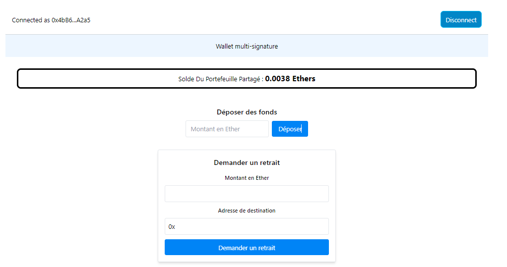
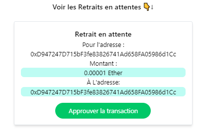
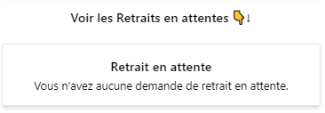

# React + TypeScript + Vite + Wagmi
# L'interface de l'application lorsqu'on est connecté avec l'un des compte spécifier sur le contrat

## S'il y a des demande de retrait à approuver

## S'il n'y a aucune demande en attente

